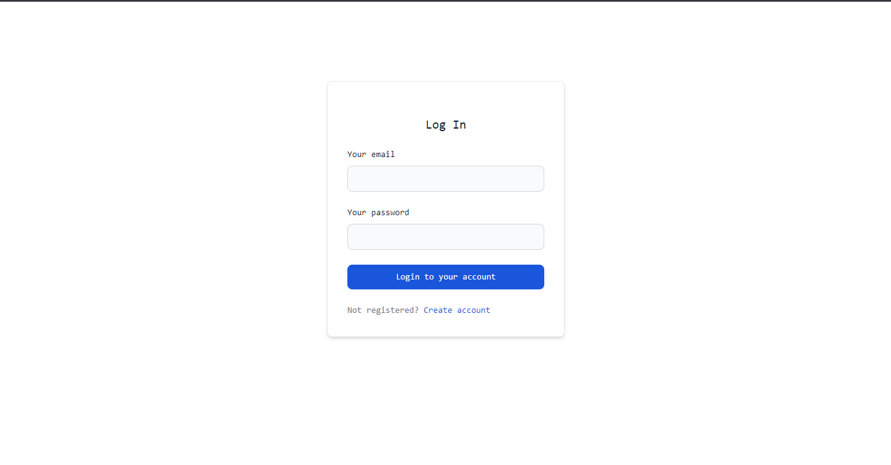

# LaraBlog
Sebuah blog system berbasis aplikasi web dibuat dengan laravel

## Table of contents

- [Overview](#overview)
  - [Screenshot](#screenshot)
  - [Features](#features)
- [Technology](#technology)
- [Author](#author)

## Overview

### Screenshot

    

        
        
    

    

        
        
    

    

        
    

### Features

- Mampu membuat, menghapus, dan mengedit post
- Memiliki fitur pencarian yang fleksibel.
- Dapat menambahkan, menghapus, dan modifikasi category dan user.
- Memiliki sistem roling
- Memiliki fitur autentikasi dan otorisasi
- Memiliki fitur follows
- Memanfaatkan mysql sebagai databasenya.

## Technology

- Nodejs
- TailwindCss
- Flowbite
- Php
- Laravel
- Mysql

## Author

- Instagram - [@re.kunn](https://www.instagram.com/re.kunnn)
- Facebook - [@re](https://https://www.facebook.com/profile.php?id=100057378866749)
